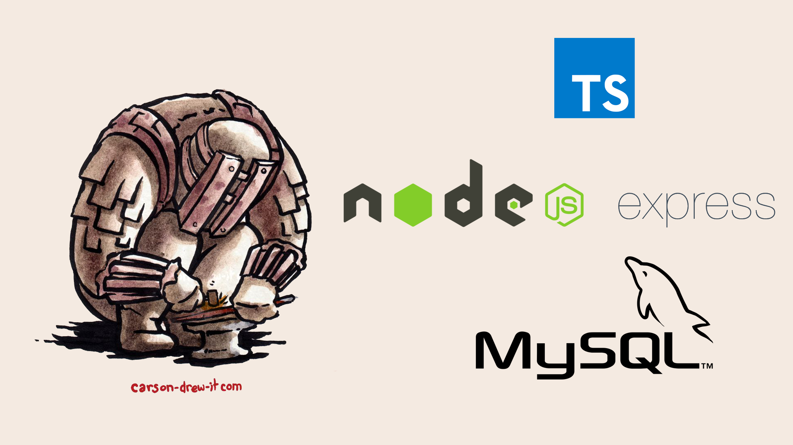

# ⚒️ Trybesmith



## 📡 Desenvolvimento

Projeto desenvolvido na <a href="https://betrybe.com/" target="_blank">Trybe</a> durante o módulo de Back-End!

Nesse projeto foi desenvolvido uma API RESTful de vendas de uma loja de itens medievais em TypeScript. Onde é possivel realizar as operações básicas que se pode fazer em um determinado banco de dados: Criação, Leitura, Atualização e Exclusão. A autenticação foi feita com Json Web Token.

## 🚀 Instalação e execução

<details>
<summary>Instalação e execução com Docker</summary>
<br />

Para rodar está aplicação é necessário ter **Git**, **Docker** e o **Docker Compose** instalados no seu computador. O Docker Compose precisa estar na versão **1.29** ou superior.

### 1 - Clone o repositório:

```
git clone git@github.com:lauropera/trybesmith.git
```

### 2 - Na raíz do projeto, suba os containers `trybesmith` e `trybesmith_db` utilizando o docker-compose.

    docker-compose up -d --build

### 3 - Execute o script SQL para criar o banco de dados

Conecte ao servidor MySQL rodando na porta 3306 usando um cliente MySQL de sua preferência. Utilize as seguintes credenciais:

* host: `db`
* user: `root`
* password: `password`

Então, no cliente, rode o script que está no arquivo `Trybesmith.sql`.

### 4 - Abra o terminal do container `trybesmith`.

    docker exec -it trybesmith bash

### 5 - No terminal do container, instale as dependências com o comando:

    npm install

### 6 - Agora execute a aplicação com o comando:

    npm start

</details>
<br />

## 📚 Documentação

Acesse a rota http://localhost:3000/docs para acessar a documentação e testar a API. Se preferir, utilize um cliente de requisições HTTP de sua preferência (Insomnia, Thunder Client, etc) para fazer as requisições.

<br />

## ⚙️ Tecnologias

- TypeScript
- Node.js
- Express.js
- Express Async Errors
- Json Web Tokens
- DotEnv
- Joi
- Docker
- MySQL
- Swagger

#

<div>
  <p align="center">🍐</p>
</div>
